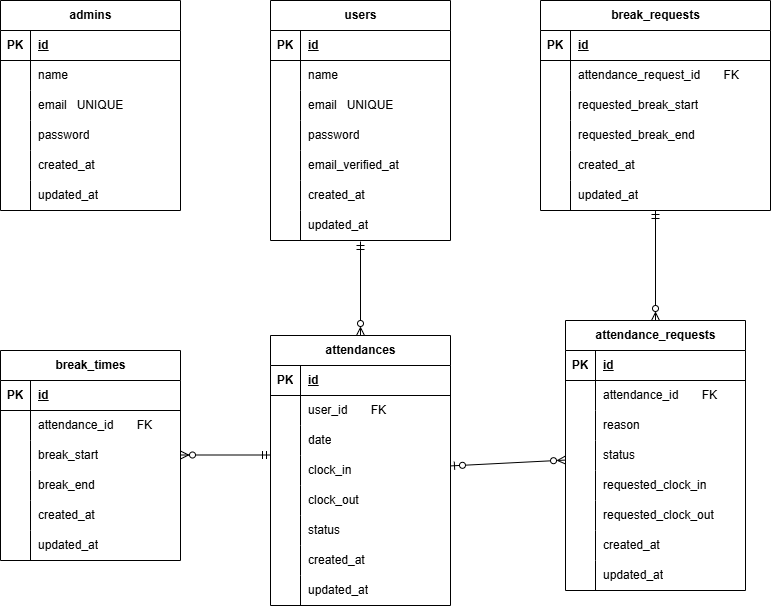

# 模擬案件２（勤怠管理アプリ）

## 概要

laravelを用いた勤怠管理アプリケーションです。
スタッフの勤怠情報作成と管理機能を実装しています。

---

## 環境構築

### 1.リポジトリのクローン

```bash
git clone git@github.com:akari44/attendance-app.git
cd attendance-app
```

### 2. .env ファイルの作成

```Bash
cp .env.example .env
```

### 3.環境変数の設定

以下の値を.envに設定してください：

```env
DB_USERNAME=sail
DB_PASSWORD=password
```

### 4.DockerDesktop の起動

Docker Desktop アプリを起動してください。

### 5.Composerインストール（依存パッケージのインストール）

```Bash
docker run --rm \
    -u "$(id -u):$(id -g)" \
    -v "$(pwd):/var/www/html" \
    -w /var/www/html \
    laravelsail/php82-composer:latest \
    composer install
```

### 6. sail起動

```Bash
./vendor/bin/sail up -d
```

Dockerのビルド・起動も同時に行われます。

### 7.アプリケーションキーの生成

```Bash
sail artisan key:generate
```

### 8.マイグレーション・シーディングの実行

```Bash
sail artisan migrate --seed
```

---

## 主な機能

- 一般ユーザー登録 / ログイン
- 管理者ログイン
- 勤怠打刻機能（一般ユーザーのみ）
- 勤怠ステータス表示機能（一般ユーザーのみ）
- 勤怠一覧確認機能
- 勤怠詳細確認機能
- 勤怠修正申請機能
- 勤怠修正承認・修正機能（管理者のみ）

---

## 使用技術（実行環境）

- PHP 8.2
- Laravel 10
- MySQL 8.0
- Laravel Sail
- Docker Desktop
- Docker Compose
- phpMyAdmin
- Mailhog
- GitHub

---

## システム要件（抜粋）

| 項目           | 内容                         |
| -------------- | ---------------------------- |
| 開発環境       | 開発者がローカル環境を用意   |
| 本番サーバー   | 設置しない                   |
| ドメイン       | 取得しない                   |
| SSL            | 考慮しない                   |
| データベース   | MySQL                        |
| セキュリティ   | アプリケーション内に限り考慮 |
| 開発言語       | PHP / Laravel                |
| バージョン管理 | Docker / GitHub              |
| リリース予定   | 4ヶ月後                      |

---

## ER図

## 

## 動作確認

### アプリケーション

以下にアクセスしてください。

#### 管理者

- http://localhost/admin/login

#### 一般ユーザー

- http://localhost/login

### phpMyAdmin

- http://localhost:8080

---

### テストユーザー

以下のユーザーでログイン可能です。

#### 管理者

| メールアドレス      | パスワード |
| ------------------- | ---------- |
| admin@coachtech.com | password   |

#### 一般ユーザー

| 名前       | メールアドレス          | パスワード |
| ---------- | ----------------------- | ---------- |
| 西　伶奈   | reina.n@coachtech.com   | password   |
| 山田　太郎 | taro.y@coachtech.com    | password   |
| 益田　一世 | issei.m@coachtech.com   | password   |
| 山本　敬吉 | keiichi.y@coachtech.com | password   |
| 秋田　朋美 | tomomi.a@coachtech.com  | password   |
| 中西　教夫 | norio.n@coachtech.com   | password   |

- テストユーザーはシーディングで作成されています。
- テストユーザーには、それぞれ本日までの勤怠情報が作成されています。

### Mailhog（メール確認）

- http://localhost:8025

---

## PHPUnitによる機能テスト

### 1. テスト用データベースの作成

```bash
sail mysql -u root -ppassword
```

```sql
CREATE DATABASE laravel_test;
exit;
```

### 2. テスト実行

```bash
sail test
```

#### 特定テストのみ実行する場合

```bash
sail test --filter=テスト名
```

---
